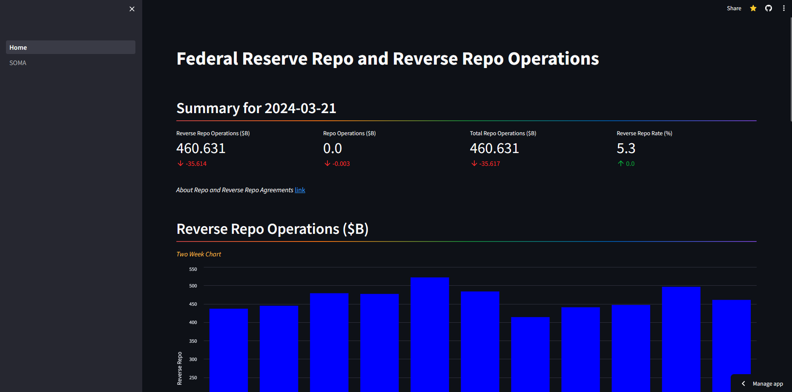
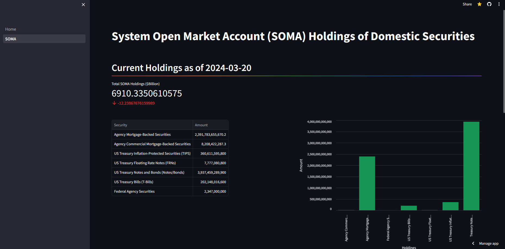

## Federal Reserve Repo, Reverse Repo and SOMA

## Terms
The Federal Reserve conducts several open market operations to influence the federal funds rate, which is the interest rate at which banks lend and borrow reserves overnight. These operations include **repo**, **reverse repo**, and **SOMA** operations.

**Repo:** (repurchase agreement) is a transaction in which the Federal Reserve buys securities from a bank with an agreement to sell them back at a later date. This transaction increases the bank's reserves and provides the Federal Reserve with collateral. The interest rate on a repo is called the repo rate.

**Reverse Repo:** (reverse repurchase agreement) is a transaction in which the Federal Reserve sells securities to a bank with an agreement to buy them back at a later date. This transaction decreases the bank's reserves and provides the Federal Reserve with collateral. The interest rate on a reverse repo is called the reverse repo rate.

**SOMA:** (System Open Market Account) is the Federal Reserve's portfolio of securities that it has acquired through open market operations. The SOMA includes Treasury securities, agency securities, and mortgage-backed securities. The Federal Reserve uses the SOMA to conduct repo and reverse repo operations, as well as other monetary policy tools.

These operations are used to manage the supply of reserves in the banking system and influence the federal funds rate. By adjusting the repo and reverse repo rates, the Federal Reserve can encourage or discourage banks from borrowing or lending reserves, which affects the federal funds rate. The SOMA is used to provide collateral for these transactions and to manage the Federal Reserve's balance sheet.

¹²³
* (1) Reverse Repo Operations - FEDERAL RESERVE BANK of NEW YORK. https://www.newyorkfed.org/markets/desk-operations/reverse-repo.
* (2) The Fed - Monetary Policy Tools - Federal Reserve Board. https://www.federalreserve.gov/monetarypolicy/bsd-monetary-policy-tools-201705.htm.
* (3) FAQs: Overnight Fixed-Rate Reverse Repurchase Agreement Operational .... https://resources.newyorkfed.org/markets/rrp_faq_130920.html.
* (4) FAQs: Reverse Repurchase Agreement Operations - FEDERAL RESERVE BANK of .... https://www.newyorkfed.org/markets/rrp_faq.html.

## Repo and Reverse Repo
API Call:
url = "https://markets.newyorkfed.org/api/rp/all/all/results/lastTwoWeeks.json"
request = requests.get(url)
content = request.json()
repo_ops = (content['repo']['operations'])

Data is extracted from JSON object to create the following:
  1) Repo and Reverse Repo operations for the day
  2) Bar chart of reverse repo operations for last two weeks
  3) Bar chart of repo operations for last two weeks
  4) Total repo operations 

## System Open Market Account (SOMA)
API Call:
url = "https://markets.newyorkfed.org/api/soma/summary.json"
request = requests.get(url)
content = request.json()
soma_ops = (content['soma']['summary'])

Data is extracted from JSON object to create the following:
  1) Total SOMA holdings
  2) Bar chart of SOMA holdings
  3) Table of SOMA holdings
  4) Bar chart of historical SOMA holdings 